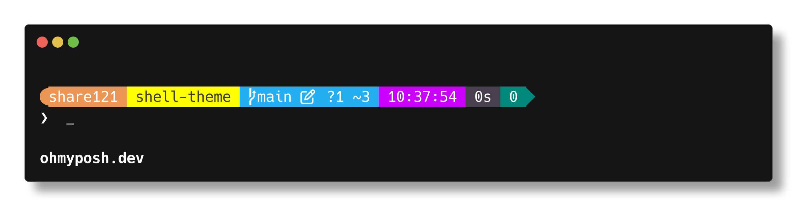

# share121 的 shell 主题


[](https://github.com/share121/shell-theme/blob/main/LICENSE)



## 安装 Oh My Posh

https://ohmyposh.dev/

## 安装主题

### Windows

#### 打开配置文件脚本

```shell
notepad $PROFILE
```

> [!TIP]
> 如果没有配置文件，请创建一个
>
> ```shell
> New-Item -Path $PROFILE -Type File -Force
> ```

### 添加以下内容

#### 方式一：从 Github 实时加载主题

```shell
oh-my-posh init pwsh --config https://gh.llkk.cc/https://github.com/share121/shell-theme/raw/refs/heads/main/share121.json | Invoke-Expression
```

> [!TIP]
> 如果提示 “无法加载文件 xxx 因为在此系统上禁止运行脚本......" 错误，请运行下面脚本来解除系统的脚本运行限制
>
> ```shell
> Set-ExecutionPolicy RemoteSigned -Scope CurrentUser
> ```
>
> 选择“是（Y）”

#### 方式二：从本地文件加载主题

每次从 Github 下载文件太慢了，可以下载 [share121.json](https://raw.githubusercontent.com/share121/shell-theme/refs/heads/main/share121.json) 然后存到随便一个文件夹里

> [!TIP]
> 右键[此链接](https://raw.githubusercontent.com/share121/shell-theme/refs/heads/main/share121.json)，选择“将链接另存为”即可下载

```shell
oh-my-posh init pwsh --config <路径>/share121.json | Invoke-Expression
```

> [!TIP]
> 如果提示 “无法加载文件 xxx 因为在此系统上禁止运行脚本......" 错误，请运行下面脚本来解除系统的脚本运行限制
>
> ```shell
> Set-ExecutionPolicy RemoteSigned -Scope CurrentUser
> ```
>
> 选择“是（Y）”

## 鸣谢

修改自
[jtracey93](https://github.com/JanDeDobbeleer/oh-my-posh/blob/main/themes/jtracey93.omp.json)
的主题

1. 添加了 `Ctrl` + 左键单击 文件夹名称自动打开文件夹的功能
2. 去除了 `branch (...)` 这个多余的提示文本
3. 添加了 Node.js 中包管理器名称展示
4. 添加了 Python Venv 的名称展示
5. 去除了 Spotify 音乐展示
6. 添加了当前时间展示
